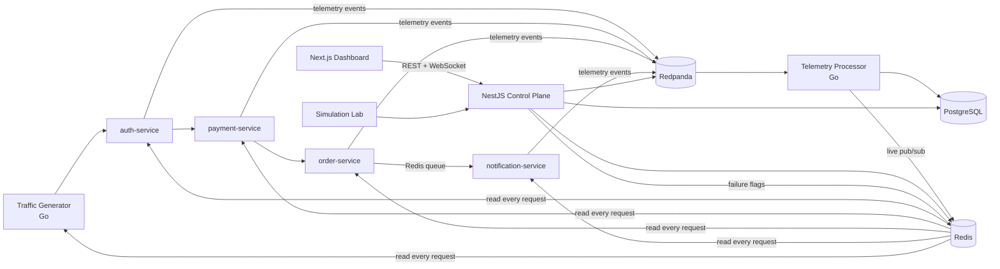

<p align="center"></p>

<h3 align="center">A distributed systems observability lab — break things on purpose, watch the telemetry tell the story.</h3>

PulseGrid is a working, end-to-end observability platform for a simulated microservice
architecture. Four Go services process synthetic traffic, stream telemetry through Redpanda, and a
stream processor turns raw events into health states, metrics, distributed traces, alerts, and
incidents — all rendered live on a Next.js dashboard. A Simulation Lab injects real failures
(latency, error spikes, outages, queue stalls, malformed events) so every observability feature
can be exercised on demand.

**This is a portfolio/demo system, not a monitoring product.** The traffic is synthetic by design;
everything downstream of it — trace propagation, windowed metrics, the alert state machine,
incident correlation, dead-letter handling — is real and inspectable.

## Architecture



## Quickstart

```bash
git clone <this repo> && cd pulsegrid
docker compose up --build        # first build takes a few minutes
```

| URL | What |
|---|---|
| http://localhost:3000 | Dashboard — click **Enter Live Demo** |
| http://localhost:4000/docs | Swagger for the control-plane API |
| http://localhost:3001 | Grafana (anonymous viewer) — pipeline internals |
| http://localhost:9090 | Prometheus |

Suggested first five minutes: enter the demo → watch the Overview go green → open the
**Simulation Lab** → run *Payment Slowdown* → watch Alerts move `pending → firing`, an incident
open with a root-cause hint, then run *Full Recovery* and watch it resolve. Full script in
[docs/DEMO.md](docs/DEMO.md).

## What's inside

- **4 simulated Go services** (auth → payment → order → notification) with W3C `traceparent`
  propagation, per-session failure injection, a Redis-backed notification queue with retry →
  dead-letter semantics, and Prometheus-format `/metrics`.
- **Streaming pipeline**: 5 Redpanda topics; a Go processor that validates against a versioned
  schema, dead-letters invalid events (with recorded reasons), dedupes, persists to PostgreSQL,
  computes 60-second sliding-window metrics + health per service, and publishes live updates.
- **Deterministic alerting**: 6 rules, full lifecycle (`inactive → pending → firing →
  acknowledged → resolved`) with `for`-duration semantics — no flapping on transient spikes.
- **Incident engine**: opens on critical alerts, builds a live timeline, computes MTTD/duration,
  and derives root-cause hints from dependency-graph correlation (evidence always shown; no ML).
- **Session-isolated demo**: every visitor gets a sandbox; scenarios, rate limits, resets, and
  data expiry are per-session.
- **Dashboard**: overview, per-service metrics, trace waterfalls, alert & incident detail pages,
  live event stream, dead-letter queue with *real* retry, and the Simulation Lab.

## Repository layout

```
services/            # 6 Go binaries (4 services, traffic generator, telemetry processor)
go/shared/           # telemetry, tracectx, health, alerting, correlate, failure, ... (unit-tested)
apps/api/            # NestJS control plane + WebSocket live gateway
apps/web/            # Next.js 14 dashboard
packages/            # event-schemas (zod), shared-types, config, ui, database (SQL)
infrastructure/      # docker, redpanda topics, prometheus, grafana
tests/               # e2e (Playwright), integration (Go), load (k6)
docs/                # architecture, data model, API, decisions, demo script, ...
```

## Testing

```bash
make test-unit          # Go unit tests + zod schema tests (no infra needed)
make test-integration   # pipeline round-trip tests (stack must be up)
make test-e2e           # Playwright: scenario → alert → incident → recovery flows
make test-load          # k6 baseline, p95 < 500ms threshold
```

## Documentation

[ARCHITECTURE](docs/ARCHITECTURE.md) · [DATA_MODEL](docs/DATA_MODEL.md) · [API](docs/API.md) ·
[DECISIONS](docs/DECISIONS.md) · [DEMO script](docs/DEMO.md) · [DEPLOYMENT](docs/DEPLOYMENT.md) ·
[SECURITY](docs/SECURITY.md) · [TESTING](docs/TESTING.md) · [DESIGN_SYSTEM](docs/DESIGN_SYSTEM.md)

## Resume-ready description (honest by construction)

> Built PulseGrid, an event-driven observability lab: 4 Go microservices streaming telemetry
> through Redpanda (5 topics) into a stream processor computing sliding-window metrics, service
> health, and a deterministic 5-state alert lifecycle; W3C trace-context propagation with a
> waterfall viewer; incident engine with dependency-graph root-cause correlation; dead-letter
> queue with operational retry; session-isolated multi-tenant demo (NestJS, Next.js, PostgreSQL,
> Redis, Docker, GitHub Actions).

## License

MIT — see [LICENSE](LICENSE).
